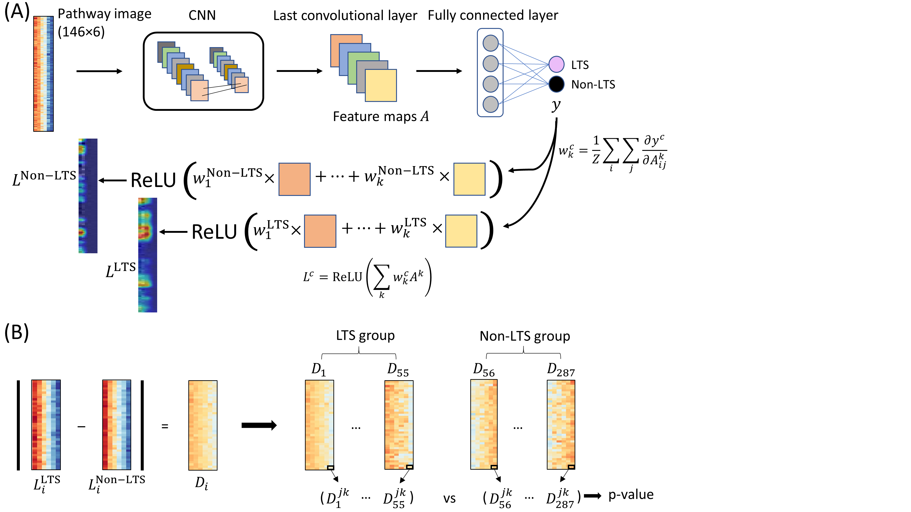

# Interpretable convolutional neural networks on multi-omics data predict long-term survival in glioblastoma

Jung Hun Oh 1,†,∗, Wookjin Choi 2,†, Euiseong Ko 3, Mingon Kang 3,∗, Allen Tannenbaum 4 and Joseph O. Deasy 1  

1Department of Medical Physics, Memorial Sloan Kettering Cancer Center, New York, USA, 
2Department of Computer Science, Virginia State University, Petersburg, USA, 
3Department of Computer Science, University of Nevada, Las Vegas, USA and 
4Departments of Computer Science and Applied Mathematics & Statistics, Stony Brook University, New York, USA  

*To whom correspondence should be addressed.  
†The authors wish it to be known that, in their opinion, the first two authors should be regarded as Joint First Authors.  

Contact: <ohj@mskcc.org> or <mingon.kang@unlv.edu>

1. Model Building  
   - pathcnn.py  

2. GradCAM  
   - pathcnn_gradcam.py

3. Multi-omics data
